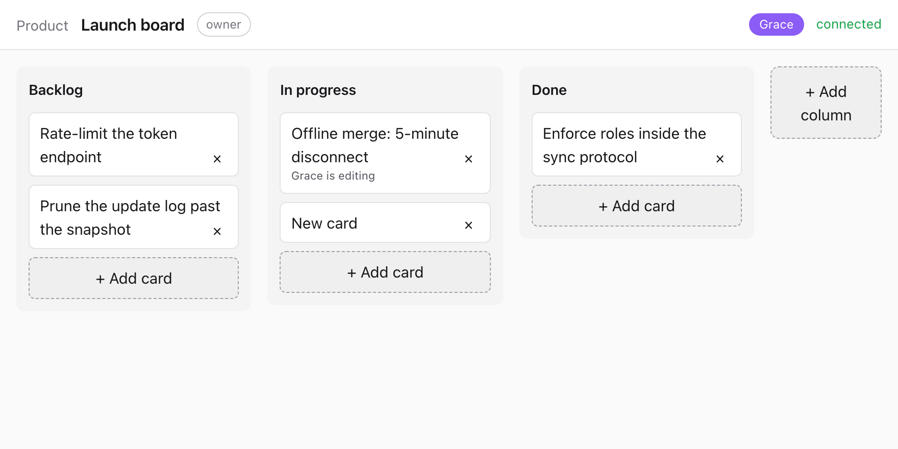
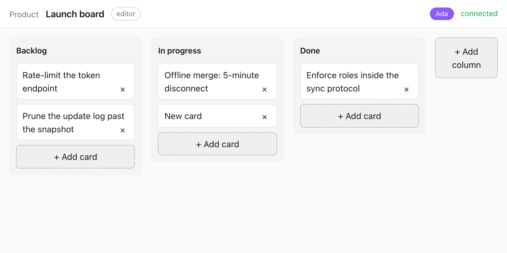
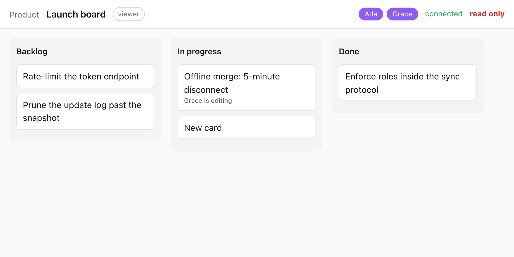
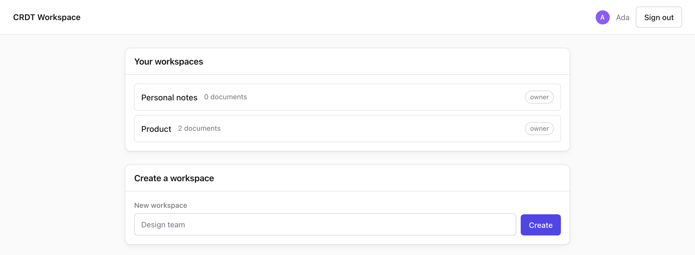
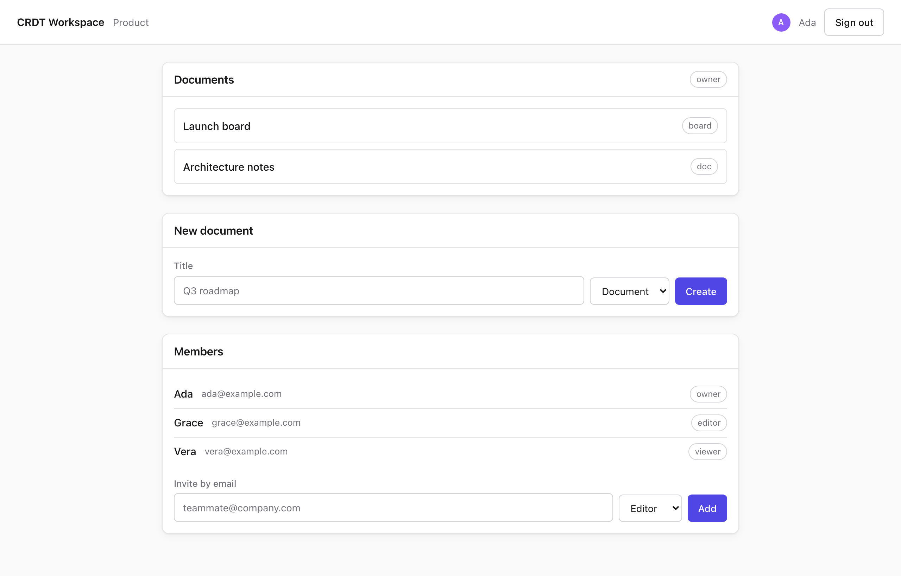
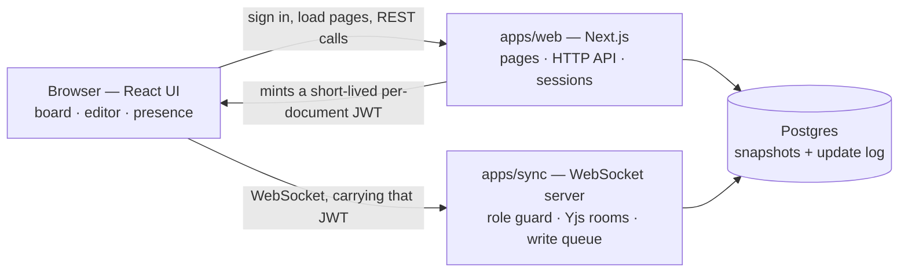

# CRDT Collaborative Workspace

A full-stack real-time collaborative workspace: a Kanban board and a rich-text
document that several people edit at the same time, where every edit merges without
conflicts even after someone has been offline. A React frontend, two Node services,
a Postgres database, and an authentication and authorization system, all built here.

| Layer | What it is |
|---|---|
| **Frontend** | Next.js 16 App Router and React 19: sign-in, dashboard, workspaces, the board and rich-text editor, live presence |
| **HTTP API** | Eight Next.js route handlers: sign-up, sign-in, sign-out, workspaces, documents, members, per-document tokens |
| **Real-time** | A standalone Node WebSocket server ([`apps/sync`](apps/sync)) that owns the live documents and speaks the Yjs sync protocol |
| **Data** | Postgres through Prisma 7: snapshot plus update-log persistence, with a write-behind queue kept off the broadcast path |
| **Auth** | scrypt password hashing, signed session cookies, short-lived per-document JWTs, and three roles enforced at the wire protocol |
| **Tests** | 164 unit and integration tests (Vitest) plus 19 end-to-end tests (Playwright, driving two real browsers) |

Merge correctness comes from [Yjs](https://github.com/yjs/yjs). Everything around it
— the transport, who is allowed to write, what happens when the database is slow, and
what survives a restart — is the part that was actually worth building, and is what
most of this README is about.

## What it looks like

### One board, open as two different people

| Ada, the owner | Grace, an editor |
|---|---|
|  |  |

Grace added a card and hovered another one. Both reach Ada's window in milliseconds,
over a WebSocket, through the sync server — including the "Grace is editing" marker,
which rides the same connection as awareness state rather than the document itself.

### A viewer sees every edit live, and cannot make one



The add and delete controls are gone, and the header reads **read only** while the
connection still reads **connected**: a viewer keeps receiving every edit in real
time. Hiding the buttons is only a courtesy. The rule itself lives in
[`apps/sync/src/guard.ts`](apps/sync/src/guard.ts), which rejects a viewer's frames
before they reach the shared document, so a hand-crafted WebSocket frame gets no
further than the UI would.

### Workspaces, documents, and members

| Your workspaces | Inside one workspace |
|---|---|
|  |  |

Roles are `owner`, `editor`, and `viewer`. Asking for a workspace you are not a
member of returns 404 rather than 403, so the API never confirms that an id exists
to someone with no access to it.

## The 30-second demo

Open a board in two browser windows side by side. Drag a card in one window and
watch it move in the other. Turn off networking in one window, keep dragging cards
and editing text, then turn networking back on — both windows converge on the same
state without losing either side's edits.

**It is not deployed yet.** Everything here runs locally today — see
[Development](#development) to start it yourself, and [Deployment](#deployment) for
the hosting setup.

### Using the app

1. Start Postgres, the sync server, and the web app — see [Development](#development) below.
2. Open <http://localhost:3000>. You will be sent to the sign-in page.
3. Choose **Create one** to sign up. Passwords must be at least 12 characters.
   Signing up gives you a workspace of your own.
4. From the dashboard, open your workspace, create a document or a board, and
   open it.
5. To collaborate, invite a teammate from the workspace's **Members** panel.
   They must have signed up first — invitations are by email address of an
   existing account, and there is no invitation email.

Roles are `owner`, `editor`, and `viewer`. A viewer's edits are rejected at the
sync server, not just hidden in the UI.

## How it fits together



Two processes, deliberately. The Next.js app handles everything request-shaped:
sessions, authorization, workspaces, documents. The sync server handles everything
connection-shaped: it holds each open document in memory, decides per frame whether
the sender may write, broadcasts to the other clients, and batches writes to
Postgres behind the broadcast rather than in front of it.

They never call each other. The only thing passing between them is a JWT, signed by
the web app and verified by the sync server, naming the document and the caller's
role. That is what lets the sync server authorize a connection without a database
round trip, and what keeps either process replaceable.

### Where the backend actually is

| What | File |
|---|---|
| Role enforcement, per WebSocket frame | [`apps/sync/src/guard.ts`](apps/sync/src/guard.ts) |
| Document rooms, broadcast, idle eviction | [`apps/sync/src/room.ts`](apps/sync/src/room.ts) |
| Write-behind persistence queue | [`apps/sync/src/update-queue.ts`](apps/sync/src/update-queue.ts) |
| Snapshot and update-log storage | [`apps/sync/src/store.ts`](apps/sync/src/store.ts) |
| Connection handling and the upgrade race | [`apps/sync/src/server.ts`](apps/sync/src/server.ts) |
| Sessions and password hashing | [`apps/web/src/lib/session.ts`](apps/web/src/lib/session.ts) |
| Authorization, 404 before 403 | [`apps/web/src/lib/auth-guard.ts`](apps/web/src/lib/auth-guard.ts) |
| The cross-process JWT contract | [`packages/shared/src/doc-token.ts`](packages/shared/src/doc-token.ts) |
| Conflict-free card ordering | [`packages/shared/src/fractional-index.ts`](packages/shared/src/fractional-index.ts) |

## Why Yjs rather than a hand-written CRDT

Merge correctness for concurrent, out-of-order edits is a solved and adversarially
tested problem — Yjs has years of fuzzing and production use behind its algorithm.
Re-deriving that from scratch would have consumed the entire project's time budget
and produced something with fewer guarantees than what already exists. The
engineering that was actually worth doing on this project is everything *around*
the CRDT: the transport, who is allowed to write, what happens when the database is
slow, and how two clients agree on card order without a central sequence. That is
where the code below lives, and where the interesting bugs were.

## Why the sync server is hand-rolled anyway

Using Yjs for the merge algorithm doesn't mean you get authorization for free. Role
enforcement has to happen *inside* the sync protocol, not in front of it: a viewer
must be able to send `sync-step1` (asking the server what it has) and awareness
frames (their cursor position) while being unable to send `sync-step2` or `update`
frames — the only two frame kinds that carry actual document mutations. All four are
`messageSync`-family frames on the wire, distinguished only by their second
varUint. There is no HTTP-layer place to reject "the mutating half of this
protocol" — the rejection has to be a decision made per frame, after decoding just
enough of it to see its kind and nothing else.

That decision is centralized in
[`apps/sync/src/guard.ts`](apps/sync/src/guard.ts) — a pure function from
`(role, frameKind)` to an allow/deny/notify decision, under 50 lines, with no I/O
and no Yjs types in its signature. It has no default-allow branch: an unrecognized
frame kind is a TypeScript exhaustiveness error at compile time, and if one still
reaches the function at runtime it is denied. This is the one piece of the system
worth reading in full, and the tests that pin it (`viewer writes never escape the
originating client`) are worth reading second.

## How persistence works

Every accepted update is appended to an append-only `DocumentUpdate` log, plus a
periodic full-state `DocumentSnapshot` every 100 updates so reloading a
long-lived document doesn't mean replaying its entire history. Neither write
happens on the request path: updates are handed to an in-memory
[`UpdateQueue`](apps/sync/src/update-queue.ts) that batches them and flushes to
Postgres on a 500ms timer or after 64 pending updates, whichever comes first — so a
slow or momentarily unreachable database degrades durability, never collaboration
latency.

**This is a real durability window, not a rounding error.** If the process is
killed hard (not `SIGTERM`, an actual `SIGKILL` or a host crash) inside that 500ms
window, whatever hadn't flushed yet is gone from the database. Two things make this
acceptable rather than alarming: connected clients still hold every update they
made in their own in-memory Yjs document and simply re-send it on reconnect (Yjs's
state-vector exchange, below, makes that automatic — the server just looks like it
never received it, not like it received and forgot it), and a graceful shutdown
(`SIGTERM`, which is what Fly and most orchestrators send before a `SIGKILL`)
explicitly drains the queue before the process exits (`apps/sync/src/index.ts`'s
signal handler calls `queue.close()`, which flushes, before closing the server and
disconnecting Prisma). The failure mode that isn't covered is the same one every
write-behind cache has: an unclean process death that also takes down every
connected client before they reconnect. At this project's traffic and stakes that
trade is the right one; it would not be if this were a payments ledger.

## How reconnection works

The sync server speaks the standard Yjs sync protocol (`y-protocols`), which is
state-vector based, not log-replay based. On reconnect, a client sends `sync-step1`
containing a compact summary of what it already has (its state vector); the server
diffs that against its own document and sends back only the operations the client
is missing. The catch-up payload is proportional to *what changed since the client
was last connected*, not to the document's total history — a client that
disconnected for ten seconds and one that disconnected for ten days both do exactly
this one round trip, and the size of the response scales with the former's answer,
not the latter's.

## Why cards use fractional indices

Cards live in a single flat `Y.Map<Y.Map<string>>` (`packages/shared/src/board.ts`),
keyed by card id, where each card carries its own `columnId` and a fractional
`order` string (`packages/shared/src/fractional-index.ts`) rather than living inside
a `Y.Array` that belongs to its column.

The alternative — a `Y.Array` per column — has a concurrency bug baked into its
shape: if two people drag the same card into two different columns at the same
moment, each of them is inserting into an array the other doesn't know about yet.
Yjs will merge both inserts, and the card now exists twice, in two columns
simultaneously — or, depending on the exact interleaving, gets dropped entirely.
With a flat map, moving a card is two field writes (`columnId`, `order`) on the
*one* map entry that represents that card. There is only ever one entry, so it can
only ever be in one place; a concurrent move and a concurrent title edit both land
on the same `Y.Map` and merge field-by-field instead of racing to define the card's
existence. Sorting a column for display is just filtering the flat map by
`columnId` and sorting by `order`.

## How I'd scale this

Today, one Node process holds every open document as an in-memory Yjs doc, and all
of that document's connections attach to that same process. That's correct for the
traffic this is built for and wrong by roughly two orders of magnitude: there's no
way to run a second `apps/sync` instance today without splitting a document's
connections across two processes that can't see each other, which fails silently —
users just stop seeing each other's edits, with no error anywhere.

The path to fix that, in order: shard documents across sync instances by hashing
`documentId`, add Redis pub/sub so an update accepted on one instance fans out to
every other instance that has a connection open for that document, and put a
consistent-hash router in front so a given document's connections always land on
the same instance (or a small, known set of instances) rather than round-robining
randomly. None of that exists yet. The comment on `min_machines_running = 1` in
[`apps/sync/fly.toml`](apps/sync/fly.toml) exists specifically so nobody scales this
past one machine by reflex before that work is done — right now doing so doesn't
even fail loudly, it just quietly breaks collaboration for whoever ends up on the
"wrong" instance.

## What I deliberately did not build

- **Update-log pruning.** `DocumentUpdate` rows are never deleted. At demo scale the
  table stays small, and keeping every row for free preserves the option of a
  version-history feature later. If a document's log ever grows large enough to
  slow down initial load, the fix is a bounded one: delete update rows older than
  the newest durable snapshot, which is safe precisely because a snapshot is
  self-contained.
- **Multi-instance fan-out.** See "How I'd scale this" above — this is the reason
  `apps/sync` is pinned to exactly one machine today.
- **Live role changes for connected users.** If a workspace owner demotes an
  editor to viewer while that editor has an open WebSocket connection, the demoted
  user keeps editor-level access on that connection until they reconnect (a new
  connection mints a new token with the current role). The token is checked at
  connect time, not on every frame, which is also what keeps the per-frame guard
  in `guard.ts` cheap.
- **Version-history UI.** The data (`DocumentSnapshot` and the full `DocumentUpdate`
  log) is there; there's no screen that reads it yet.

## Repository layout

```
apps/web        Next.js app: auth API, workspace/document API, the board and
                editor UI, connecting to apps/sync over a WebSocket per document.
apps/sync       Standalone WebSocket server: owns in-memory Yjs docs, enforces
                roles inside the sync protocol, batches writes to Postgres.
packages/shared Yjs-facing logic shared by both: the board's CRDT shape,
                fractional indexing, and the JWT format that carries a document's
                caller and role from apps/web to apps/sync.
packages/db     Prisma schema and client, shared by both apps.
```

**Note on Prisma 7:** this project runs Prisma 7, which has no bundled Rust query
engine — `packages/db` constructs its client with the `@prisma/adapter-pg` driver
adapter over `pg` directly (`packages/db/src/index.ts`), not a bare
`new PrismaClient()`. This matters if you're used to older Prisma versions; the
adapter is not optional here.

## Development

```bash
pnpm install
```

`pnpm install` regenerates the Prisma client automatically via a root
`postinstall` script whenever the dependency graph changes — you should not need to
run `prisma generate` by hand.

Local dev needs a Postgres reachable at the `DATABASE_URL` in `.env` (copy
`.env.example` and fill in real secrets; `docker-compose.yml` will start one for you
on the standard port 5432 if you don't already have Postgres running). You do
**not** need to export any environment variables by hand: `apps/web/next.config.ts`
loads the repo-root `.env` directly as plain Node (Next runs config files outside
webpack/Turbopack), which is also why `apps/web`'s `dev` and `build` scripts force
`--webpack` — Turbopack cannot resolve `@crdt/shared`'s NodeNext-style `.js`
imports, and even under webpack, `packages/db`'s own `.env` loading has to happen
outside the bundle (see the comments in `next.config.ts` and
`packages/db/src/index.ts` for exactly why).

Run the sync server and the web app:

```bash
pnpm --filter @crdt/sync run dev
pnpm --filter @crdt/web run dev
```

Run tests:

```bash
pnpm test              # unit + integration tests, root vitest config
pnpm test:watch
pnpm --filter @crdt/web exec playwright test   # two-browser collaboration e2e
```

Type check:

```bash
pnpm typecheck
```

## Seeding a demo workspace

`scripts/seed-demo.ts` creates a demo user, workspace, and a board with three cards
that walk through the demo above ("open this in two windows", "drag a card", "go
offline"). It writes the board through the same `DocumentUpdate` log the sync
server itself writes through, so the seeded board loads by the exact same code path
as any real document — there's no seed-only shortcut that could mask a bug in the
real load path.

```bash
DEMO_PASSWORD='<pick one>' pnpm exec tsx scripts/seed-demo.ts
```

Requires `DATABASE_URL` to be set (from `.env` locally, or the real host environment
in production) and prints the seeded document's URL path on success.

## Deployment

Two Fly.io apps: `apps/sync` (the WebSocket server, pinned to a single machine —
see "How I'd scale this") and `apps/web` (the Next.js app, stateless and free to
scale), sharing one Postgres. Both have a `Dockerfile` and `fly.toml` in this repo,
verified with a local `docker build` for each; neither has been deployed from this
environment. **The commands below are the documented deployment procedure — they
have not been run as part of building this repo**, and running them creates real,
billable cloud resources, so they're left as a runbook for whoever does the actual
deploy, not something this task executed on its own.

```bash
fly postgres create --name crdt-db --region ord
fly apps create crdt-sync
fly apps create crdt-web
fly postgres attach crdt-db --app crdt-sync
fly postgres attach crdt-db --app crdt-web
```

Set the secrets — the same `SYNC_JWT_SECRET` on both apps, since it is the contract
between them:

```bash
SYNC_SECRET=$(openssl rand -hex 32)
fly secrets set SYNC_JWT_SECRET="$SYNC_SECRET" --app crdt-sync
fly secrets set SYNC_JWT_SECRET="$SYNC_SECRET" --app crdt-web
fly secrets set SESSION_SECRET="$(openssl rand -hex 32)" --app crdt-web
fly secrets set NEXT_PUBLIC_SYNC_URL="wss://crdt-sync.fly.dev" --app crdt-web
```

```bash
fly deploy --config apps/sync/fly.toml --app crdt-sync
fly deploy --config apps/web/fly.toml --app crdt-web
```

Apply the migration against production:

```bash
fly ssh console --app crdt-web -C "pnpm --filter @crdt/db exec prisma migrate deploy"
```

Then seed the demo workspace against production by running `scripts/seed-demo.ts`
with `DATABASE_URL` pointed at the production database (for example via
`fly postgres connect` or by running the script from `fly ssh console` with the
app's own environment).

**One thing worth knowing about the `prisma generate` and `prisma migrate deploy`
steps above:** `packages/db/prisma.config.ts` still resolves `DATABASE_URL` eagerly
as part of loading its config, even for commands like `generate` that never open a
connection — so the variable has to be *set* (to a real value for `migrate deploy`,
to any placeholder for `generate`) before either command runs; an entirely unset
`DATABASE_URL` fails config loading before Prisma gets anywhere near a connection
attempt. Both Dockerfiles handle this at build time with a throwaway `DATABASE_URL`
that is never baked into the image's persistent environment (see the comments next
to the `prisma generate` steps in `apps/sync/Dockerfile` and `apps/web/Dockerfile`).
The `fly ssh console ... prisma migrate deploy` command above runs against the
app's real environment, where `DATABASE_URL` is already set via the Fly Postgres
attachment, so no placeholder is needed there. (An earlier version of
`prisma.config.ts` also crashed on a missing `.env` file before it even got to the
`DATABASE_URL` check, independent of this — that was fixed to match the same
`try/catch` guard `packages/db/src/index.ts` already had, so it no longer matters
whether a `.env` file exists on the machine running any of these commands.)

## Local Docker verification

Both Dockerfiles were verified with a real `docker build` and a real container run
against the local dev Postgres (the project's actual dev database, running via an
uncommitted `docker-compose.override.yml` on port 5433) — not just assumed to work
from reading them:

```bash
docker build -f apps/sync/Dockerfile -t crdt-sync:verify .
docker build -f apps/web/Dockerfile -t crdt-web:verify .
```

Both images start, connect to Postgres, and respond over HTTP (`/healthz` for
`apps/sync`, `/` for `apps/web`) when run with real environment variables. No
container from this verification was left running.

## Workspace structure

- `packages/shared` — Shared types, the board's CRDT shape, fractional indexing,
  and the document-scoped JWT format
- `packages/db` — Prisma schema and client (driver-adapter based, see above)
- `apps/sync` — WebSocket sync server: room management, the protocol guard,
  the write-behind persistence queue, `/healthz` and `/metrics`
- `apps/web` — Next.js frontend: auth API, workspace/document API, the board and
  collaborative editor UI
- `scripts/seed-demo.ts` — Seeds a demo workspace and board
